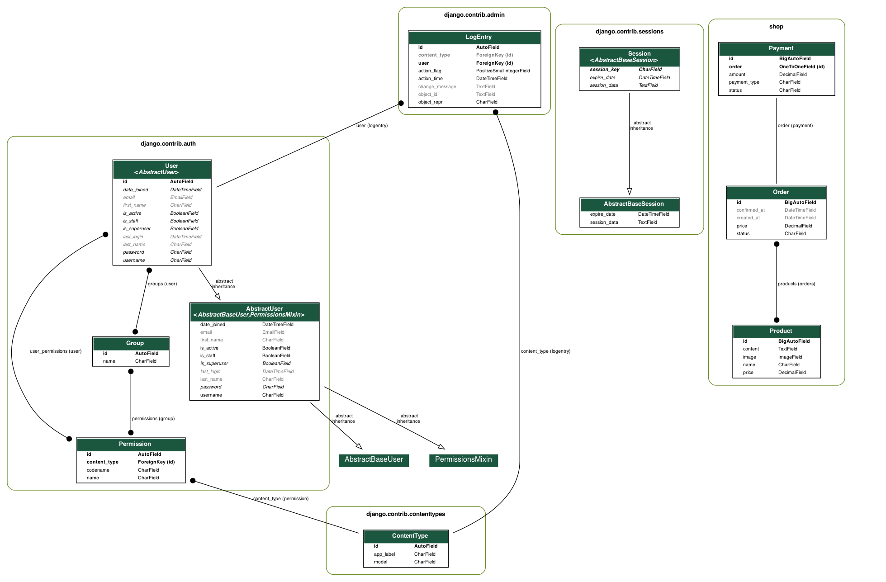

# API for shop with admin panel
## Installation
1. Create and activate virtual environment, install dependencies
```
make install
```
2. Create and fill in the `.env` file similar to `.env.example`
3. Apply migrations
```
make migrate
```
4. Start the database
```
make db
```
5. Start the service
```
make run_local
```
The service will be available at
```
http://127.0.0.1:8000
```
Documentation for the service will be available at
```
http://127.0.0.1:8000/api/docs
```
## Installation with docker
1. Create and fill in the `.env` file similar to `.env.example`
2. Run the command
```
make run_docker
```
The service will be available at
```
http://127.0.0.1:80
```
Documentation for the service will be available at
```
http://127.0.0.1:80/api/docs
## Useful commands

```
make superuser   # Creating a superuser
make flash       # Database cleanup
make test        # Running tests
make format      # Running linter
```
## Database schema

```
make db_image
```